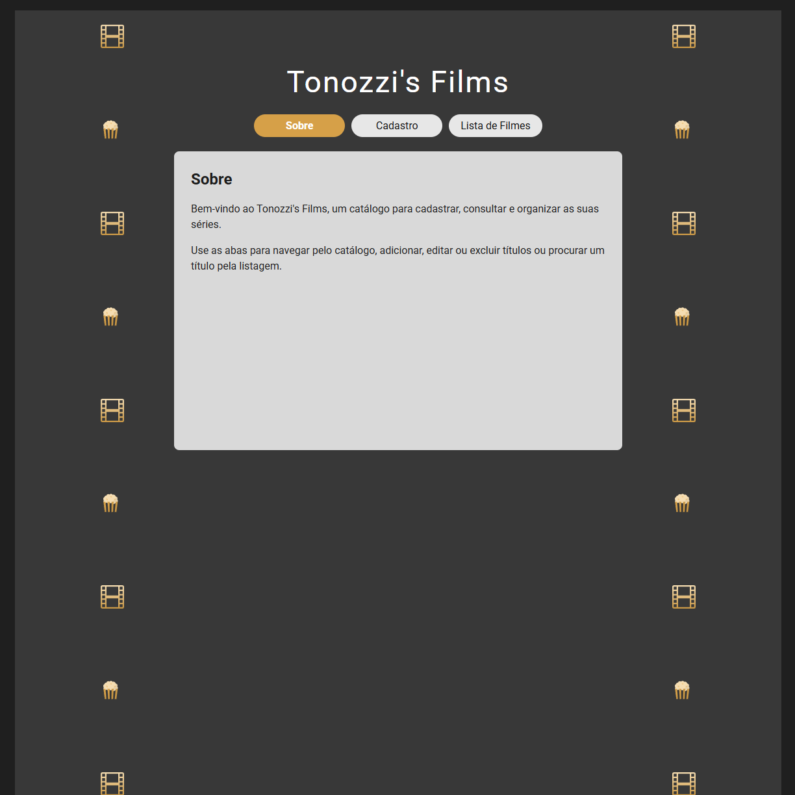
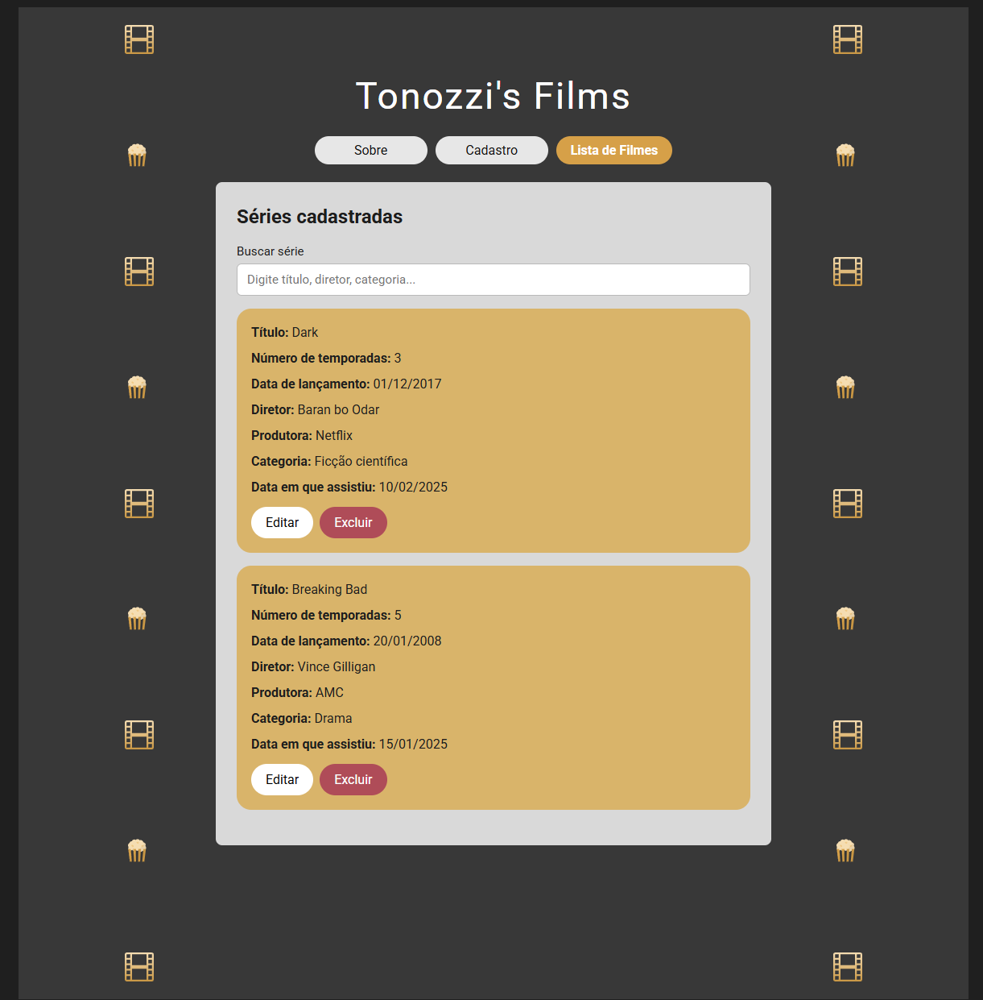
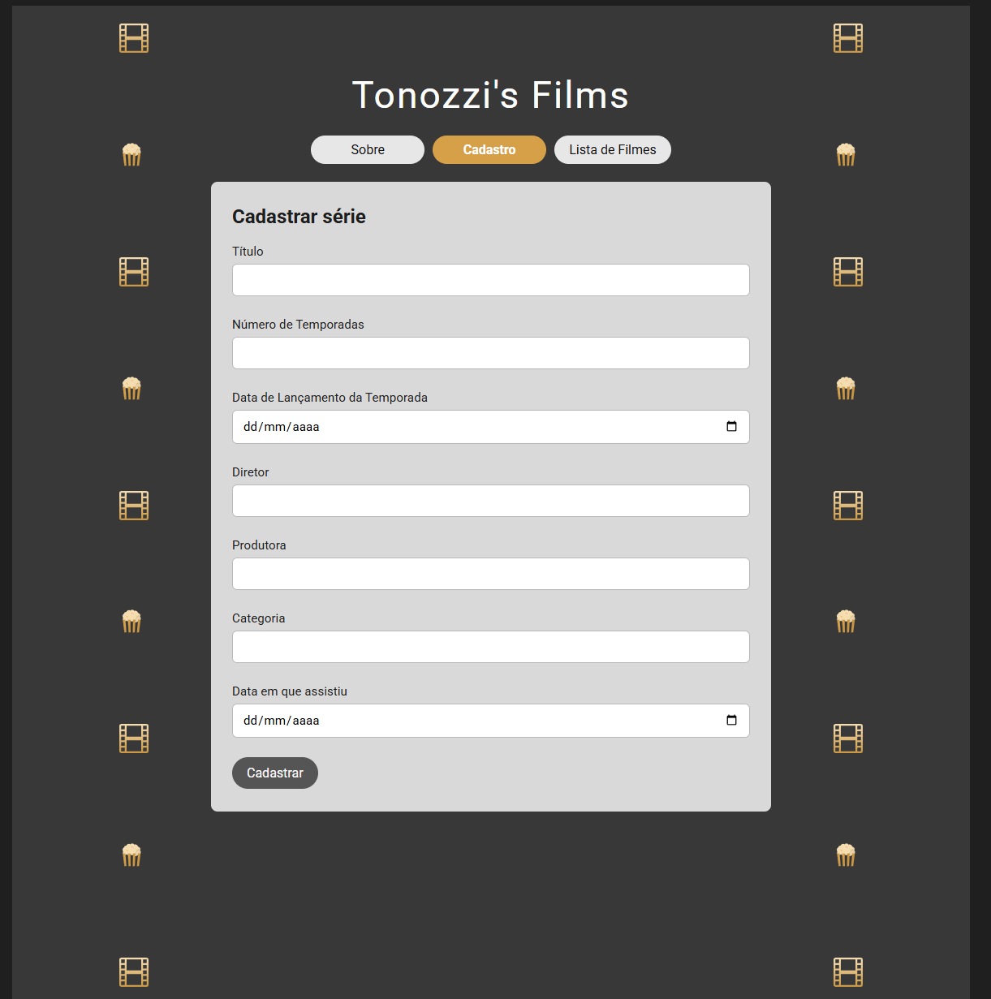

## Nome: Alanis Marques Tonozzi

Para executar este projeto:

1. Entre na pasta do projeto pelo terminal:

```bash
cd my-app
```

2. Rode `npm install` para instalar as dependências do projeto:

```bash
npm install
```

3. Em seguida, rode `npm start` para iniciar a execução do projeto:

```bash
npm start
```

Após a execução do projeto, este é o resultado esperado no navegador:





## Testes

Este projeto possui um teste básico de renderização da navegação. Para executá-lo, use:

```bash
npm test -- --watchAll=false
```

## Introdução

Este projeto contém uma aplicação React criada com Create React App para simular um CRUD estático de séries. A interface foi inspirada no mockup fornecido e permite cadastrar, listar, buscar, editar e excluir registros localmente, sem integração com API ou banco de dados.

## Componentes

Os componentes estão no diretório `./src/components` e possuem as seguintes características:

- `NavBar`
  - Descrição: este componente renderiza as abas de navegação da aplicação (`Sobre`, `Cadastro` e `Lista de Filmes`) e permite alternar entre as páginas exibidas no painel central.

- `SerieForm`
  - Props:
    - `onSave`: callback responsável por salvar uma nova série ou atualizar uma existente.
    - `editingSerie`: objeto com os dados da série em edição.
    - `onCancelEdit`: callback para cancelar a edição atual.
  - Descrição: este componente contém o formulário de cadastro e edição, realiza a validação básica dos campos obrigatórios e exibe mensagens de feedback para o usuário.

- `SerieList`
  - Props:
    - `series`: lista de séries a ser exibida.
    - `onEdit`: callback chamado ao clicar no botão de edição.
    - `onDelete`: callback chamado ao clicar no botão de exclusão.
  - Descrição: este componente lista todas as séries cadastradas com suas informações e disponibiliza ações de editar e excluir ao lado de cada item.

## Decisões de desenvolvimento

- O CRUD foi implementado de forma estática, utilizando apenas estado local em React.
- O componente `App` centraliza o estado da aplicação e coordena as interações entre formulário, listagem e navegação.
- A estilização foi mantida leve, priorizando fidelidade ao mockup sem adicionar bibliotecas externas.
- Os elementos visuais laterais foram adicionados como arquivos SVG locais para facilitar a entrega e a execução.

## Conclusão

Este projeto foi desenvolvido para demonstrar conceitos fundamentais de React, como componentização, manipulação de estado, validação de formulário e renderização dinâmica de listas, mantendo uma estrutura simples e objetiva para fins acadêmicos.
